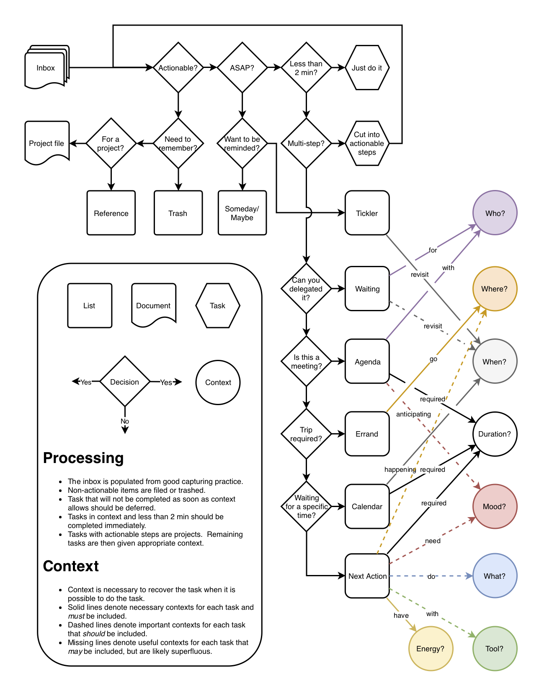
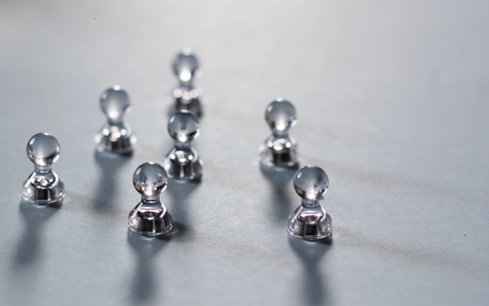
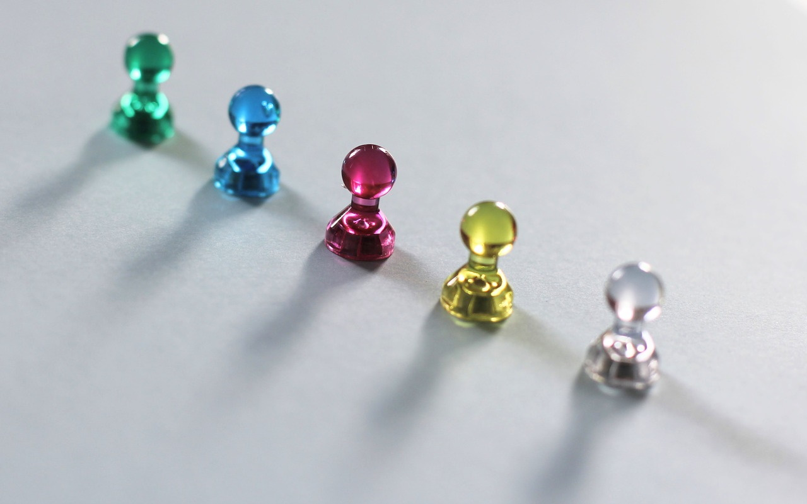
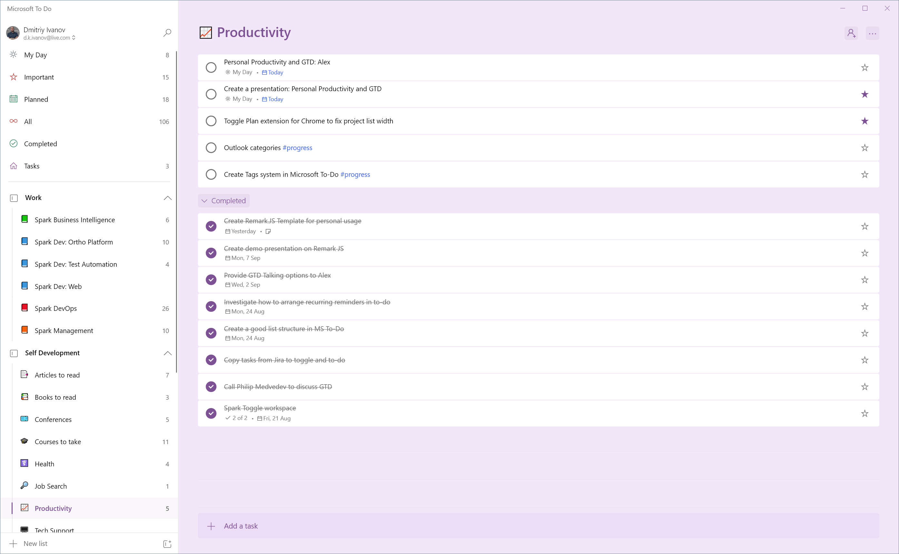
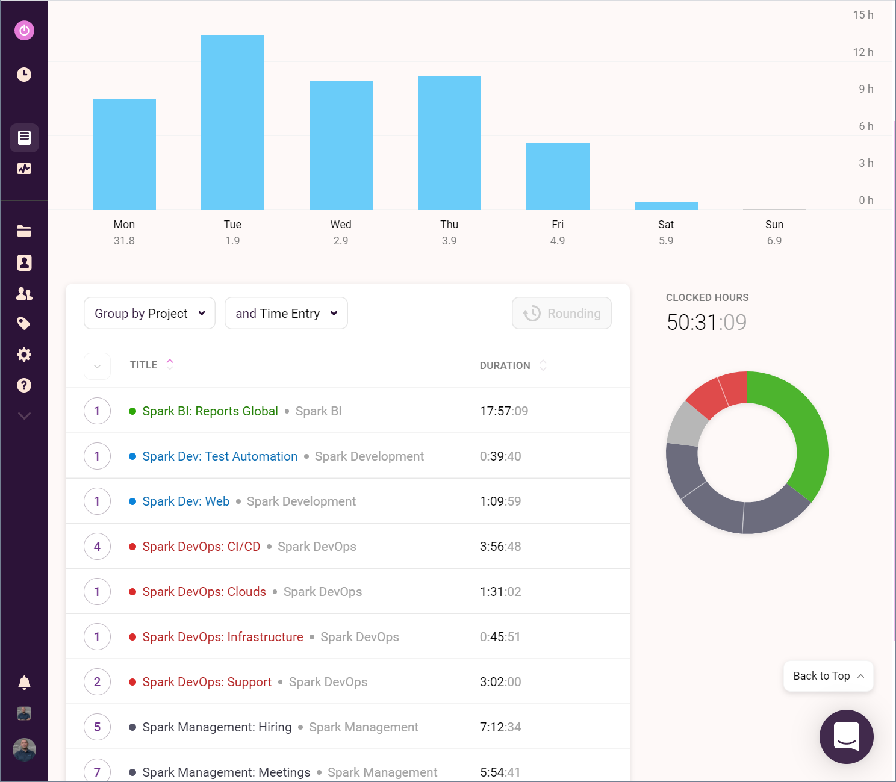
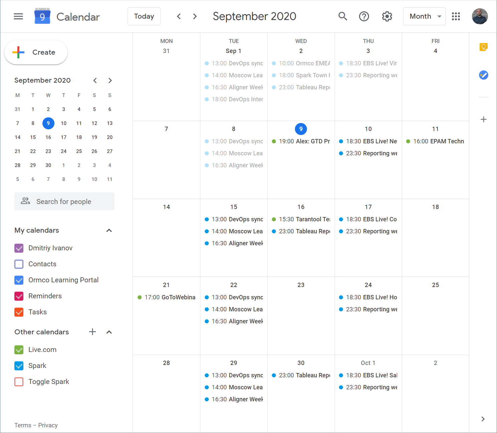
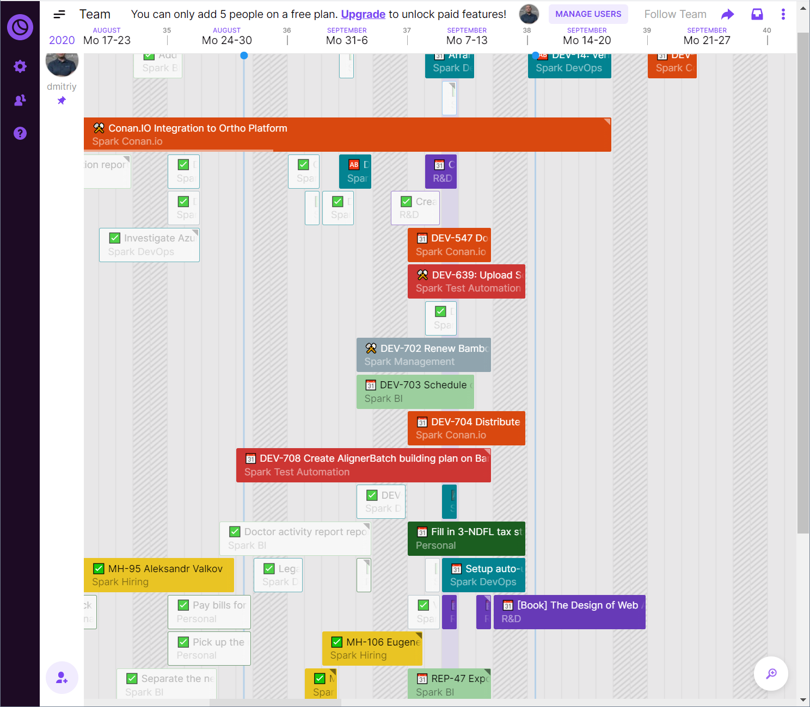
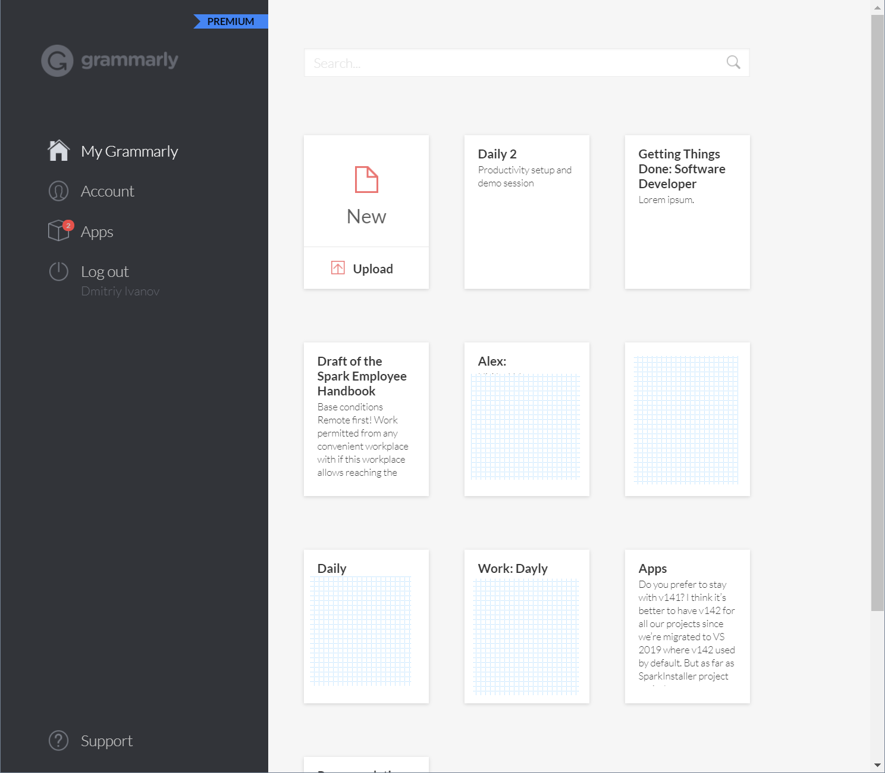

class: title-slide
background-image: url(img/corals.jpg)

# THE DONE THING

## PERSONAL PRODUCTIVITY AND GTD

Dmitriy Ivanov

September 09, 2020

---

# DISCUSSION PLAN

- Main productivity problems in the modern world.
- What is GTD?
- Basic rules.
- Tasks, Projects, Time Tracking, Labels, Hashtags.
- Available free tools.
- Demo session.
- Discussion

---

# PRODUCTIVITY PROBLEMS IN THE MODERN WORLD

--

- **Why corals?**

--

.center[
    
]

---

# PRODUCTIVITY PROBLEMS IN THE MODERN WORLD

- **Why corals?**
- The amount of inbound information nowadays is **huge**, and it's **impossible to process everything** properly.

--

- Daily planning does not exist at all.

--

- Fear to be buried under all inbound tasks.

--

- Laziness...

--

- **"I don't have time enough"** to start arranging activities.

---

# WHAT IS GTD?

--

.left-column[
    .center[
        
    ]
]

--

.right-column[
    .center[
        
    ]
]

---

# BASIC RULES TO INCREASE PRODUCTIVITY

- Keep the inbox clean.
- Reduce the number of inboxes.
- Reduce the number of productivity tools.
- Do not switch tools blindly.
- Frequently review current and past task events.
- Use Labels and Tags to group activities.
- Make an effort to keep record inbound tasks.
- Do not separate Workspaces.

---

# GOALS

--

.left-column[

## Before

.center[
    
]]

--

.right-column[

## After

.center[
    
]]

---

# PRODUCTIVITY TOOLSET: TASKS

.left-column[

- Diary
- E-mail inbox with labels
- Evernote
- Google Tasks
- Microsoft Outlook Tasks
- Microsoft To Do
- Sticky notes
- TickTick: ToDo List
- Todoist
- You name it...

]

--

.right-column[

## Personal choice - Mictosoft To Do

.center[
    
]]

---

# PRODUCTIVITY TOOLSET: TIME

.left-column[

- RescueTime
- Timely
- Toggl
- Tomato Timer

]

--

.right-column[

## Personal choice - Toggl Track

.center[
    
]]

---

# PRODUCTIVITY TOOLSET: CALENDAR

.left-column[

- Apple Calendar
- Diary
- Google Calendar
- Outlook Calendar
- You name it...

]

--

.right-column[

## Google Calendar + Outlook

.center[
    
]]

---

# PRODUCTIVITY TOOLSET: PROJECTS

.left-column[

- Basecamp
- Diary!
- Evernote
- Jira
- Microsoft Planner
- Microsoft Project
- Toggl Plan
- Trello
- Wrike
- You name it...

]

--

.right-column[

## Personal choice - Toggl Plan

.center[
    
]]

---

# PRODUCTIVITY TOOLSET: WRITING

.left-column[

- The last one, but quite important.
- Mictrosoft Word
- Grammarly
- Translator (any of them)

]

--

.right-column[

## Personal choice - ALL

.center[
    
]]

---
class: section-title-slide
background-image: url(img/demo.jpg)

## Productivity Toolset

# DEMO

---

class: section-title-slide
background-image: url(img/questions.png)

# DISCUSSION
