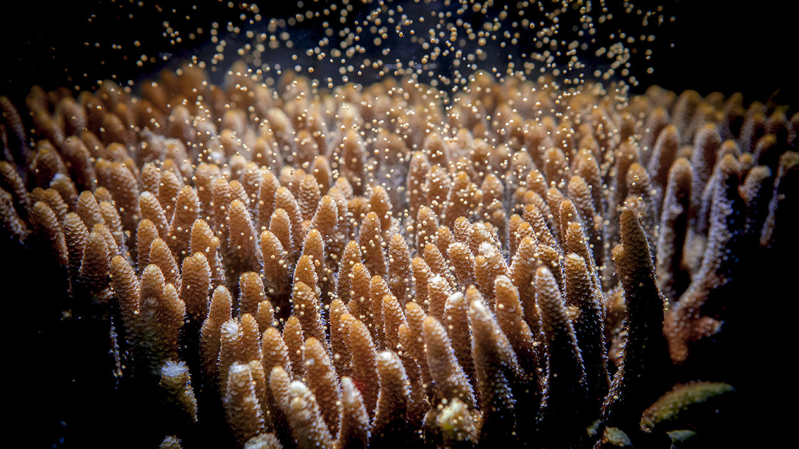

class: title-slide
background-image: url(img/corals.jpg)

# THE DONE THING

## PERSONAL PRODUCTIVITY AND GTD

Dmitriy Ivanov

September 09, 2020

---

# DISCUSSION PLAN

- Main productivity problems in the modern world.
- What is GTD?
- Basic rules.
- Tasks, Projects, Time Tracking, Lables, Hashtags.
- Available free tools.
- Demo session.
- What's next?

---

# PRODUCTIVITY PROBLEMS IN THE MODERN WORLD

--

- **Why corals?**

--

.center[
    
]

---

# PRODUCTIVITY PROBLEMS IN THE MODERN WORLD

- **Why corals?**
- The amount of inbound information nowadays is **huge** and it's **impossible to process everything** properly.

--

- Daily planning does not exist at all.

--

- Fear to be buried under all inbound tasks.

--

- Laziness...

--

- **"I don't have time enough"** to start arranging activities.

---

# WHAT IS GTD?

--

.left-column[
    .center[
        
    ]
]

--

.right-column[
    .center[
        
    ]
]

---

# BASIC RULES TO INCREASE PRODUCTIVITY

---

class: section-title-slide
background-image: url(img/demo.jpg)

## Productivity Toolset

# DEMO

---

# WHAT'S NEXT?

---

class: section-title-slide
background-image: url(img/questions.png)

# DISCUSSION
